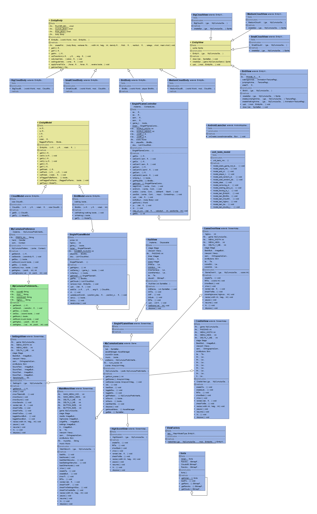
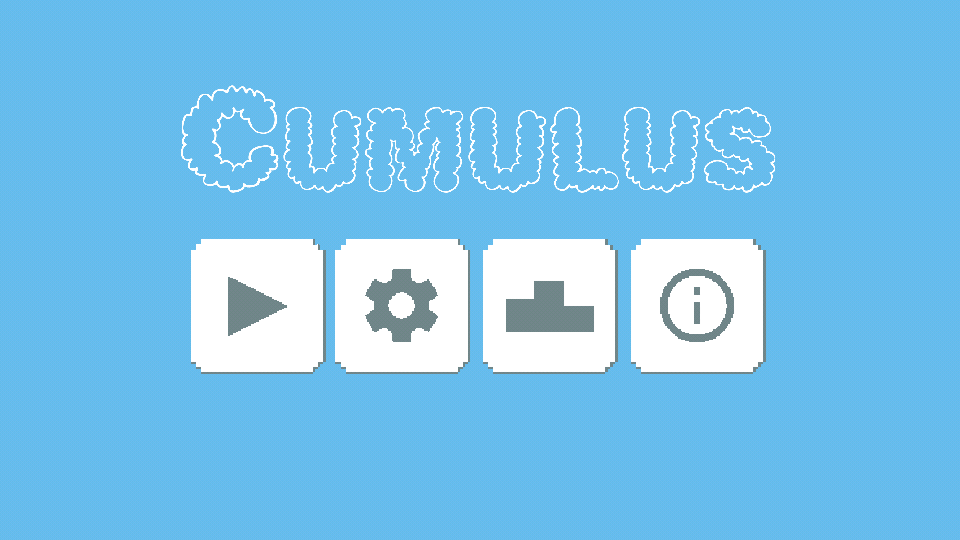
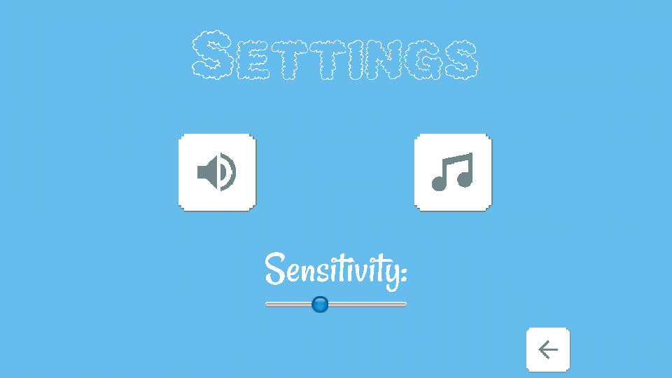
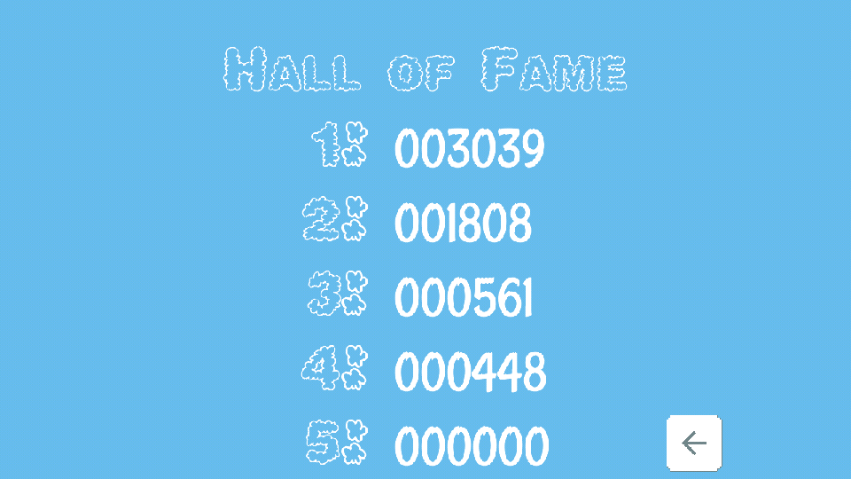
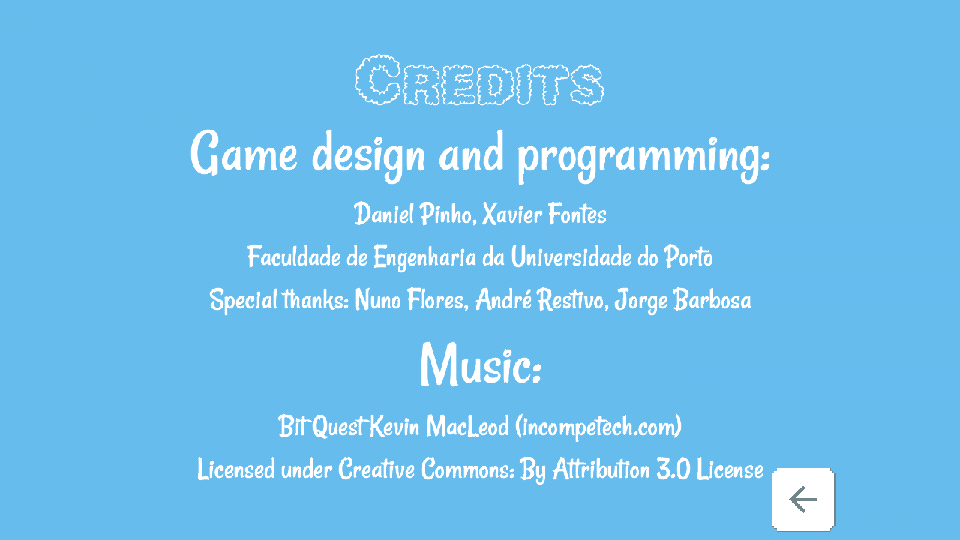
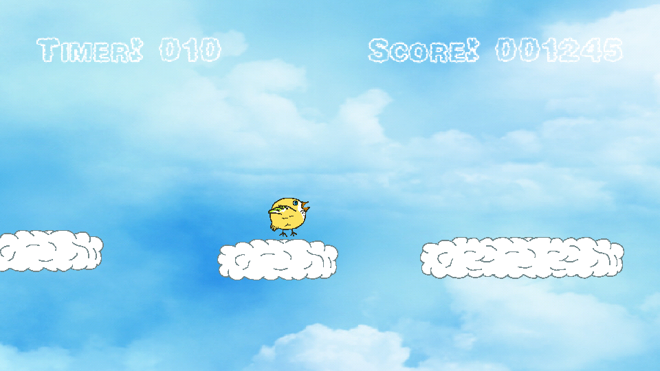

# LPOO1617_T6G4

##### Members:

- Daniel Ribeiro de Pinho (201505302)
up201505302@fe.up.pt

- Xavier Reis Fontes (201503145)
up201503145@fe.up.pt

# Setup

## Project installation
To import our project for developing purposes, it is necessary to import it as a Gradle project and to let the IDE sync the project, while also installing all the LibGDX libraries needed.

## App installation
Given that this is an Android app, the user has to download the .apk file to the device and open it in the device using a file explorer. Additionally, the user needs to allow installation from "Unknown Sources", a setting that can be found in Settings > Security.

# Development documentation
## UML Diagrams
This project is structured as we can see in the following class diagram:

## Design patterns used
This project includes in its codebase several design patterns:
* **Adapter** - 
For the preferences part of our project, we created an interface that was then implemented by the Android and the Desktop modules of our game using appropriate libraries for each instance. This way, whether we run our game on Android or on the desktop, we can be sure that the functionality holds true.
* **Singleton** - 
We used this design pattern to ensure that no more than one instance of our game controller and one instance of our game model were created. 
* **Factory** - 
By having a Factory that creates and caches our views, we were able to instanciate no more than 1 View for each of our sub-components in the game.
* **Observer** - 
Each time the controller was updated, our whole model and its intervenients were also notified and took appropriate actions.
* **MVC** - 
All our code was divided into 3 major components, Model, View and Controller. The Model contains the game logic. The Controller reads the inputs given by the View, updates the Model and itself. Because of this, the View only has to worry about reading what the Controller gives it and displaying it as it sees fit. 

## Difficulties and lessons
We encountered problems starting with the division into MVC, given that at first there were a lot of connected parts. One more hiccup was getting accoustumed to the physics engine and the whole LibGDX framework. 

In the end, it was a nice way to learn how to work with a different set of tools than the ones we are used to.

## Team effort
The team worked on this project for approximately 90 hours, with the effort being spilt evenly. Daniel worked more on the design part of the game and Xavier worked more on the gameplay; either way there was always a channel of comunication between the members as to ensure the smooth progress of this project. Additionally, both members of the group took part in pair programming on several occasions.

# User manual

## The main menu
Upon launching the game the player is greeted with the following screen, showing the game title and four buttons:

From left to right: Play game, Settings, Hall of Fame (highscores), and Credits

## The settings menu

In this menu, the player can find sound and music toggles, along with a slider for the accelerometer sensibility for the game background, since it moves according to the device's orientation.

## The Hall of Fame

In this menu, the player can see the top five scores stored in the device, along with a button to go back to the main menu.

## The credits

The credits just show the developers' names along with the professors'. The music credits are also shown.

## In the game
Cumulus is a simple endless runner; The player plays as Birb, a bird who somehow got on top of the clouds while being unable to fly. The player must keep Birb on top of the clouds as long as they can, with the bird's tiny wings only letting it double jump.

The score is calculated taking into account the time the player has managed to spend above the clouds, as well as Birb's velocity. The faster the player goes, the more the score increases. The player character can walk on the clouds, and can only jump twice before having to land on another platform again.

If the player falls below the clouds or falls behind (disappears to the left of the screen), they lose.

The user can from this screen return to the main menu and try the game again.
