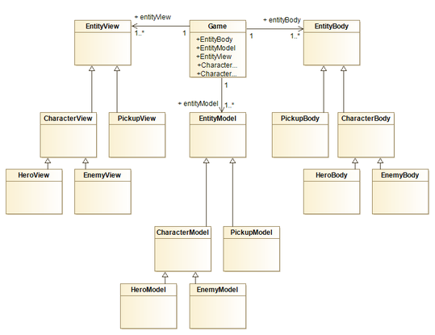
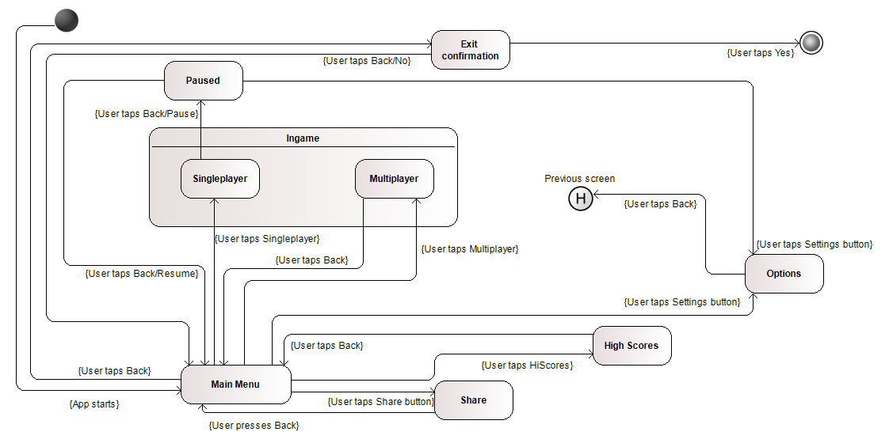
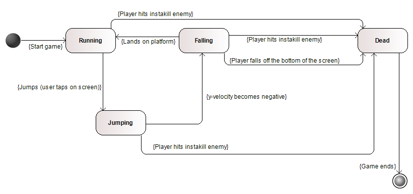
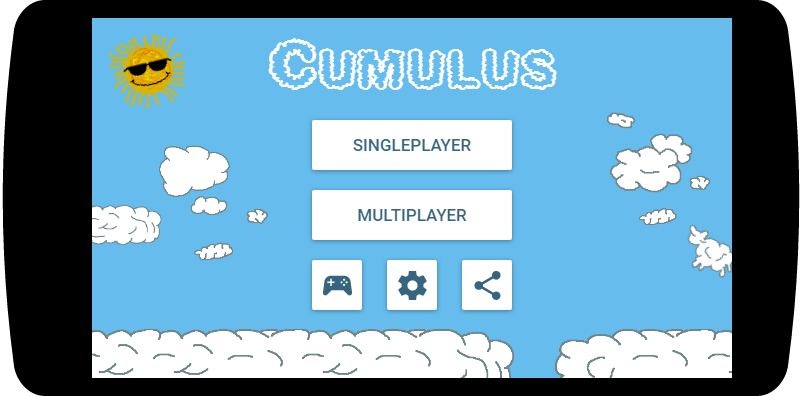
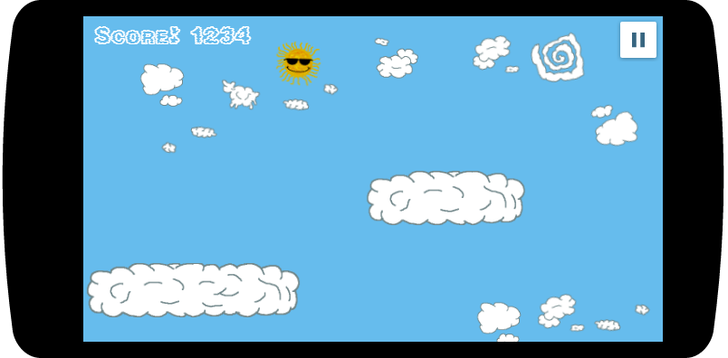
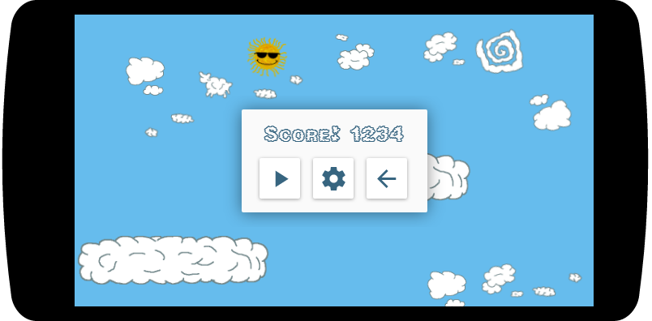
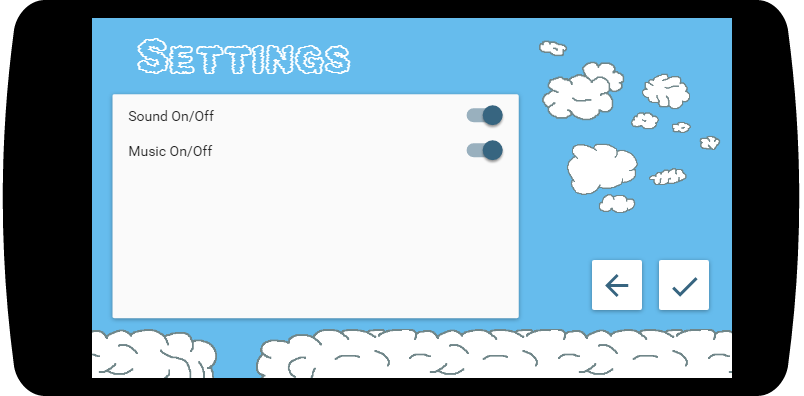

# LPOO1617_T6G4

##### Members:

- Daniel Ribeiro de Pinho (201505302)
up201505302@fe.up.pt

- Xavier Reis Fontes (201503145)
up201503145@fe.up.pt

# Architecture Design:

## Package and class diagram (UML), documenting (describing) each class' responsibility

**Game**: The class that handles the game's basic gameplay loop (receiving input, checking for loss, etc.)

The Entity/Character/Pickup/Hero/Enemy classes are split into three classes each (based on the MVC method). Generically, they are described as such:

    - Body (the "Controller" part of the MVC, it handles operations between the Model and the View).

    - Model (the Model includes the data for the class and includes methods to manipulate said data).

    - View (the View handles the reception of data to be manipulated through the Body).

**Entity**: The generic game element that is not fixed in the world. It can be split into two types: Characters and Powerups.

**Character**: An entity that represents a game character (whether it's a playable character or an enemy).

**Hero**: The player character, which is controlled by the user.

**Enemy**: An enemy. These characters can cause the game to end prematurely.

**Pickup**: Pickups are entities that bestow the player character additional attributes.

## Design of behavioural aspects

## Design Patterns to use
1. Singleton - for the main game class.
2. Decorator - for the powerups.
3. Observer - for the controllers.
4. State - for the different states of the gameplay.
5. Abstract Factory - to get the clouds.
6. Strategy - not yet determined.
# GUI Design
## Identification of the main functionalities
1. The game will be playable in Single Player or against another player.
2. The game keeps scores of single player game runs.
3. The settings of the game will allow for a player to turn off the sound in the game.
4. The game will be able to share a post on Facebook upon player's request.
## GUI mock-ups

# Test Design
## Listing of the expected final test cases
1. Test to the movement of the user throughout the level.
2. Test randomness of the generated level.
3. Test out-of-bounds behaviour.
4. Test player losing.
5. Test highscore saving.
